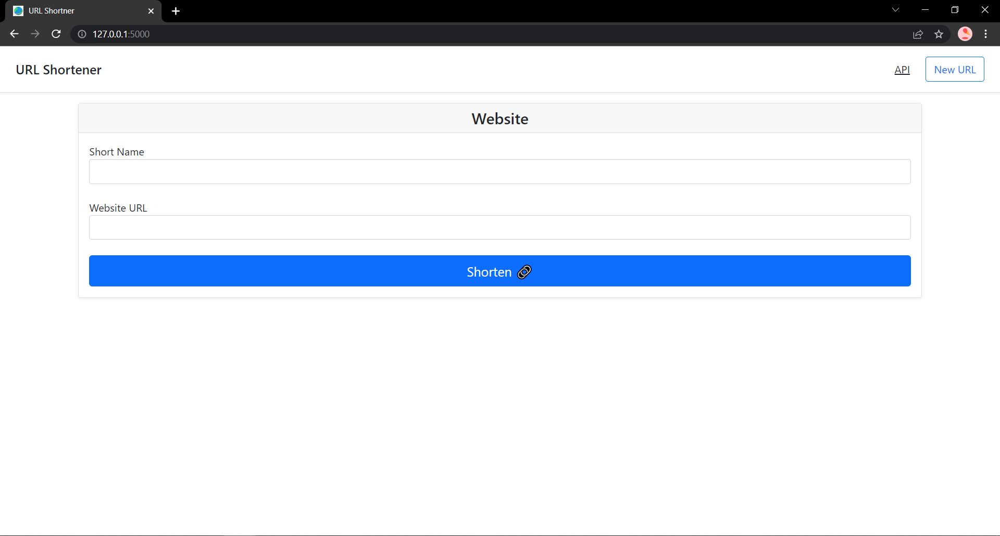
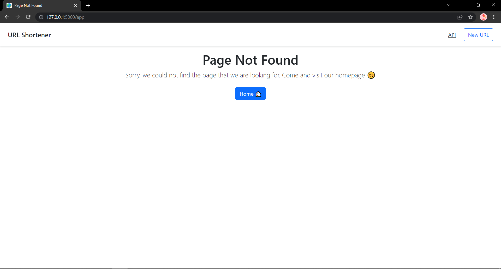
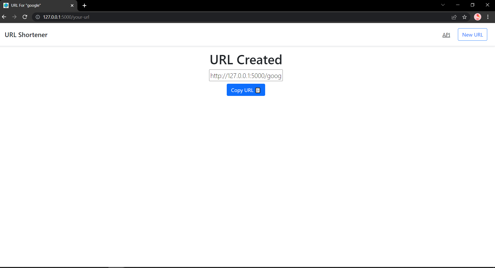
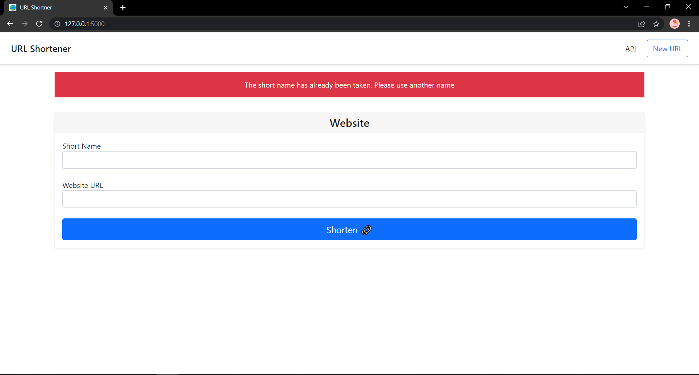

## Application: URL Shortner

### Snapshots of the Application

**Landing Page**

**Page Not Found**

**Short Name Generated**

**Short Name Taken**

#### Requirements
* Python
* Pip
* Virtual environment
* Command Line Interface (Command Prompt)
* HTML
* CSS:
	* Bootstrap Framework: 5.1.3
* JavaScript
	* jQuery Framework: 3.6.0
	* popper.js
* JSON
* Git and GitHub

### Commands
* Setting ENV Variables (Windows)
	* `set FLASK_APP=file-name`
	* `set FLASK_ENV=development`